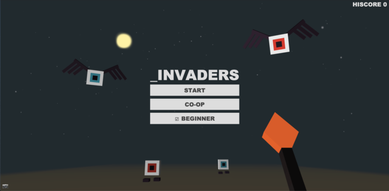
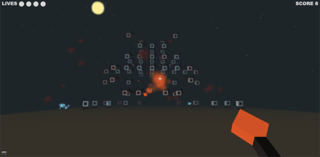

# _INVADERS

> Submission for [JS13kGames 2021](http://js13kgames.com/).

`_INVADERS` is Space Invaders-inspired game in 3D, in which you must stop endless waves of outer space invader monsters within a confined space.



## Gameplay
- Defeat endless waves of monsters in a confined space.
- Familiar gameplay elements from Space Invaders:
  - Start with 3 lives (5 for beginner mode)
  - No timer, but the game ends immediately if the monsters reach the space behind you.
  - The space between you and the monsters are reduced for each new wave
  - Flier class monsters behave the same as aliens in Space Invaders (see below).
- 3 types of monsters:
  - Flier class: Move left and right as a group, shifting forward when reaching the edge. Red-eyed ones shoot projectiles.
  - Walker class: Only move forward. Red-eyed ones shoot projectiles.
  - Laser class: Do not move, but shoot fast-moving blue projectiles.
- Beginner mode gives you extra lives in the first few waves and introduce you the different monster types one at a time. It is enabled by default for your first play.
- Mini-boss encounter (with 4 variations) on every 4th wave. You get 2 extra lifes when completing the wave:



## Controls
Mouse and Keyboard:
- Move: Arrow Keys / WASD
- Rotate View: Mouse Move
- Attack: LMB / ENTER / E

Touch Screen:
- Move: Drag left side of screen
- Rotate View: Drag right side of screen
- Attack: Press A (onscreen button)

Gamepad (only tested with Xbox, but other controllers should work):
- Move: Left stick
- Rotate View: Right stick
- Attack: RT / A

> Tips:
> - You can press and hold the Attack button/key to keep shooting.
> - On touch screen, you can press A and drag around to adjust the view while shooting.

## Web Monetization Exclusives
Subscribers should see the [Coil](https://coil.com/) icon (𝒞) at the bottom-right corner of the screen. They will get:
- An extra life
- The exclusive [Tesla Coil](https://cnc.fandom.com/wiki/Tesla_coil_(Red_Alert_1)) Weapon, which shoots slightly larger projectiles!


## Completely Optional Decentralized Features
- The game itself is on IPFS: https://cloudflare-ipfs.com/ipfs/QmQPxoC3G3KM78VDmZ4chsHSAuD3DA2WZX95XVi61u9Tre
- Click the camera icon (📷) at the bottom-left corner of the screen to take an in-game screenshot that is uploaded to IPFS / [nft.storage](https://nft.storage/)! A convenient way to make NFTs out of your gameplay screenshots!

## Browser Support
- Latest Desktop Chrome, Firefox, Edge, or Safari with WebGL 1.0 enabled
- Latest Android Browser, Android Chrome or iOS Safari
- [ANGLE_instanced_arrays](https://developer.mozilla.org/en-US/docs/Web/API/ANGLE_instanced_arrays) and [OES_standard_derivatives](https://developer.mozilla.org/en-US/docs/Web/API/OES_standard_derivatives) WebGL extensions are required for the game to work.

## The Tech
- WebGL graphics powered by [mugl](https://github.com/andykswong/mugl), my 2KB micro WebGL library
- Sound effects and music powered by [ZzFX](https://github.com/KilledByAPixel/ZzFX) and [ZzFXM](https://keithclark.github.io/ZzFXM/)
- Screenshot upload using [nft.storage](https://nft.storage/)
- Code minified and packed into single HTML file with Webpack and Terser
- Zip archive compressed with 7-Zip

## Build & Run
1. Copy `.env.template` to `.env` and set NFT_SOTRAGE_KEY. You can get an API key for free from [nft.storage](https://nft.storage/).
2. To build the 13KB zip bundle:
```
npm install && npm build
```
3. To run the dev server locally:
```
npm start
```

## License
This repository and the code inside it is licensed under the MIT License. Read [LICENSE](./LICENSE) for more information.
