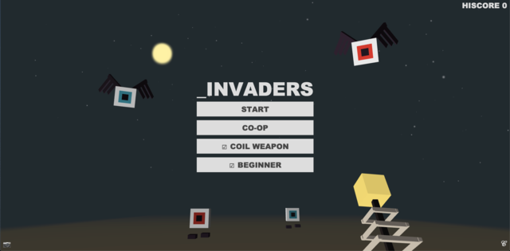

# _INVADERS

> Submission for [JS13KGames 2021](http://js13kgames.com/).

`_INVADERS` is Space Invaders-inspired game in 3D, in which you must stop endless waves of outer space invader monsters within a confined space.

Being a submission for JS13KGames, the game is 13KB when zipped (13305 out of the 13312 bytes limit to be exact). It is an experiment to see how much web tech can be packed into the game within the size limit. Technologies used includes:
- WebGL graphics powered by [mugl](https://github.com/andykswong/mugl), my 2KB micro WebGL library
- Web Audio sound effects and music powered by [ZzFX](https://github.com/KilledByAPixel/ZzFX) and [ZzFXM](https://keithclark.github.io/ZzFXM/)
- WebRTC P2P co-op (via socket.io signaling server, or decentralized via manual offer/answer exchange)
- Web Monetization
- Cross-platform controls - Mouse (Pointer Lock) & Keyboard, Touch and Gamepad
- In-game screenshot upload to IPFS using [nft.storage](https://nft.storage/)
- Local storage for persisting highscore

Code is written in Typescript, minified and packed into single HTML file using Webpack and Terser. I wrote a [Babel transform plugin](./babel.transform.cjs) to help minifying the code (saved 300 precious bytes after compression). Lastly, 7-Zip and advzip are used to produce the final ZIP archive, which saves another 500 bytes over standard zip.

I could have included WebXR support, which requires < 1KB for VR, but I chose to use the bytes for improving the gameplay instead (with the boss and beginner levels).

As allowed by rules, the game connects Google's free STUN server (stun.l.google.com:19302) for multiplayer co-op mode, and to nft.storage for the optional IPFS screenshot upload feature, but otherwise do not access any external resource and can be played anywhere from opening the index.html.


## Gameplay
- Play in offline single player mode or 2-players P2P co-op mode!
- Defeat endless waves of monsters in a confined space!
- Familiar gameplay elements from Space Invaders:
  - Start with 3 lives (4 for beginner mode)
  - No timer, but the game ends immediately if the monsters reach the space behind you.
  - The space between you and the monsters are reduced for each new wave
  - Flier class monsters behave the same as aliens in Space Invaders (see below).
- 3 types of monsters:
  - Flier class: Move left and right as a group, shifting forward when reaching the edge. Red-eyed ones shoot projectiles.
  - Walker class: Only move forward. Red-eyed ones shoot projectiles.
  - Laser class: Do not move, but shoot fast-moving blue projectiles.
- Beginner mode gives you extra lives in the first few waves and introduce you the different monster types one at a time. It is enabled by default for your first play.
- Mini-boss encounter (with 3 variations) on every 4th wave. You get 2 extra lifes when completing the wave:


## Desktop and Mobile Controls
Mouse and Keyboard:
- Move: Arrow Keys / WASD
- Rotate View: Mouse Move
- Attack: LMB / ENTER / E

Touch Screen:
- Move: Drag left side of screen
- Rotate View: Drag right side of screen
- Attack: Press A (onscreen button)

Gamepad (only tested with Xbox, but other controllers should work):
- Move: Left stick
- Rotate View: Right stick
- Attack: RT / A

> Tips:
> - You can press and hold the Attack button/key to keep shooting.
> - On touch screen, you can press A and drag around to adjust the view while shooting.

## CO-OP Mode with Server
The CO-OP mode allows 2 players to play together over WebRTC P2P connection.
The server is a simple signaling server to help establishing the WebRTC connection.

To start, player 1 can input a join code ('CODE' field) and click 'HOST'. Player 2 then inputs the same code and click 'JOIN'. After the state becomes 'READY', click 'START' to get into the game. You can also leave the join code blank and hope to find a random player doing the same.

The 'OFFER' and 'ANSWER' are used to establish a P2P connection without the signaling server, as explained in the decentralized section below.

## Web Monetization Exclusives
Subscribers will see the [Coil](https://coil.com/) icon (𝒞) at the bottom-right corner of the screen. They will get:
- An extra life
- The exclusive [Tesla Coil](https://cnc.fandom.com/wiki/Tesla_coil_(Red_Alert_1)) Weapon, which shoots slightly larger projectiles!



## Optional Decentralized Features
Decentralized features are completely optionally and not required to play the game.

IPFS:
- The game itself is on IPFS, CID: [QmdgjumYTZdm4Qa3DjD487U2fCx2p5qyVVq7iFkaHA1w3T](https://cloudflare-ipfs.com/ipfs/QmdgjumYTZdm4Qa3DjD487U2fCx2p5qyVVq7iFkaHA1w3T)
- Click the camera icon (📷) at the bottom-left corner of the screen to take an in-game screenshot that is uploaded to IPFS / [nft.storage](https://nft.storage/)! A convenient way to make NFTs out of your gameplay screenshots!

Decentralized P2P CO-OP:
- CO-OP mode is still playable without the signaling server (e.g. when server is down or you are playing on IPFS)
- To connect, 2 players need to manually exchange the OFFER and ANSWER codes (via IM, emails or any channel):
  1. Player 1 clicks HOST to get the OFFER code
  1. Player 1 sends OFFER code to Player 2
  1. Player 2 pastes OFFER code and clicks JOIN
  1. Player 2 sends ANSWER code to Player 1
  1. Player 1 pastes ANSWER code
  1. Both Player 1 and Player 2 click START to enter the game

## Browser Support
- Latest desktop and mobile browsers with WebGL 1.0 enabled (*)
- Tested browsers
  - Latest Chrome, Firefox, Edge, or Safari (#) on Windows and Mac
  - Latest Android Browser, Android Chrome or iOS Safari

\* [ANGLE_instanced_arrays](https://developer.mozilla.org/en-US/docs/Web/API/ANGLE_instanced_arrays) and [OES_standard_derivatives](https://developer.mozilla.org/en-US/docs/Web/API/OES_standard_derivatives) WebGL extensions are required for the game to work. They are supported by most browsers.

\# Known to sometimes freeze on Safari when starting the game. If this happens, try closing it and reopen the game in a new tab

## Build & Run
1. Install the package and dependencies:
    ```
    git clone https://github.com/andykswong/js13k2021.git
    git submodule update --init --recursive

    cd dependencies/munum
    npm install
    npm run build

    cd ../mugl
    npm install
    npm run build

    cd ../..
    npm install
    ```
1. To use the screenshot feature, you need to copy `.env.template` to `.env` and set NFT_SOTRAGE_PAYLOAD and NFT_SOTRAGE_SIGNATURE. You then need to get an API key for free from [nft.storage](https://nft.storage/). The key is a [JWT token](https://jwt.io/). NFT_SOTRAGE_PAYLOAD should be set to the base64 decoded payload of the key and NFT_SOTRAGE_SIGNATURE set to base64 encoded signature. This is needed to squeeze out ~20KB to fit the game within 13KB

1. Build the game and the 13KB zip bundle:
    ```sh
    npm run build
    ```
    You can find the game in [public/index.html](./public/index.html) and server code in [public/server.js](./public/server.js)

1. To run the server:
    ```sh
    npm start
    ```

## License
This repository and the code inside it is licensed under the MIT License. Read [LICENSE](./LICENSE) for more information.
